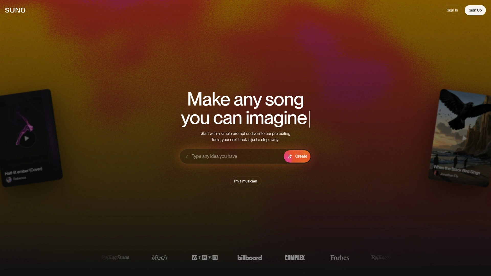

# 2025年最值得推荐的15款免费AI音乐生成工具

在视频制作、播客录制、游戏开发和内容创作的过程中,背景音乐的选择往往耗费大量时间和预算。AI音乐生成工具通过智能算法分析音乐模式、和声结构和节奏规律,让创作者无需音乐理论基础即可在几秒内生成高质量原创配乐。本文精选15款2025年表现最优的AI音乐生成平台,涵盖文本转音乐、实时生成、风格混合等核心功能,帮助你快速找到适合YouTube视频、社交媒体内容、广告项目和应用开发的完美音轨。这些工具全部提供免版税授权,让你专注创作而无需担心版权纠纷。

## **[Mubert](https://mubert.com)**

为内容创作者和应用开发者提供实时AI音乐生成的综合平台。

Mubert通过先进的AI算法将庞大的音频样本库实时组合,根据用户指定的流派、情绪和时长参数生成独特音轨。平台支持三种核心生成方式:文本提示转音乐(输入"赛博朋克雨夜城市"等描述性文字)、图像转音乐(上传照片分析色彩和纹理映射为音乐参数)、以及传统的参数化选择(从数十种流派如House、Ambient中挑选并设定最长25分钟时长)。系统提供Mubert Render用于内容创作、Mubert API供开发者集成到应用和游戏中实现动态配乐、以及Adobe扩展插件方便视频编辑工作流。免费Ambassador计划每月可生成25首曲目但需标注来源,付费套餐解锁更高生成配额和商业使用权限。特别适合需要为直播、播客、TikTok视频和YouTube内容快速配乐的创作者,以及希望在软件中嵌入自适应音乐引擎的开发团队。

## **[Suno AI](https://suno.com)**

业界领先的AI歌曲生成器,能创作包含人声演唱和完整乐器编排的原创音乐。

Suno通过文本提示生成逼真的歌曲作品,用户只需描述风格、情绪或直接输入歌词,AI即可合成带有人声演唱的完整曲目。2024年11月升级的v4模型显著提升了音乐多样性和创造力,能够生成超越常规四和弦流行音乐的复杂作品。平台支持广泛的音乐类型,在蓝调和电子音乐方面表现尤为出色,同时也能处理其他主流和小众风格。免费账户每天提供10首歌曲(50积分),单曲时长可达四分钟,付费订阅解锁更长生成时长、更高音质输出和商业使用授权。用户可以延续现有歌曲(系统分析原曲风格并继续创作),或上传自己的音频素材让AI在此基础上扩展。2024年7月推出的移动应用让音乐创作可以随时随地进行。特别适合shower歌手、独立音乐人和需要快速打样音乐创意的制作人使用。

## **[Udio](https://www.udio.com)**

由前Google DeepMind研究团队打造,以逼真人声生成能力著称的AI音乐平台。

Udio由四位前Google DeepMind研究人员于2023年12月创立,获得了Andreessen Horowitz、will.i.am和Common等音乐人的资金支持。平台核心优势在于能够生成极其逼真的人声演唱,评论者称其vocal质量"令人恐惧地好"。免费Beta版本每月允许生成600首歌曲,付费订阅解锁音频修复(Audio Inpainting)等高级功能,该功能可精确编辑单个人声音轨、修正错误或平滑过渡段落。系统通过简单文本提示运作,用户描述想要的音乐风格和情绪即可生成作品。2024年4月发布的病毒歌曲"BBL Drizzy"以及首次进入德国Top 50榜单的AI生成歌曲均出自Udio。平台界面直观易用,无需音乐技能即可在几分钟内制作出工作室级别的歌曲。适合追求高品质人声效果的音乐创作者、希望快速验证旋律想法的作曲家、以及需要为影片配乐的内容制作团队。

## **[AIVA](https://www.aiva.ai)**

专注管弦乐和电影配乐的AI作曲助手,提供深度MIDI编辑能力。

AIVA(人工智能虚拟艺术家)运用深度学习算法分析海量音乐数据库,能够跨越250多种不同风格和流派生成原创作品。平台特别擅长创作情感化的管弦乐、电影配乐和游戏音轨。用户通过简单输入如流派、速度、情绪和时长等参数,AIVA应用算法生成符合选择的独特作曲。系统内置类似数字音频工作站(DAW)的集成编辑器,允许用户深入查看、编辑和混音MIDI音轨,应用均衡器、混响、延迟等各种效果。Generation Profiles功能让作曲家创建并保存自定义设置,通过调整偏好来影响AIVA的音乐生成方式,从而建立独特的个人声音标识。用户还可以上传音频或MIDI格式的影响素材来引导生成过程。适合需要管弦乐和电影感配乐的作曲家、电影制作人,以及希望快速生成预告片和电视节目背景音乐的制作团队。

## **[Soundraw](https://soundraw.io)**

采用100%自有训练数据的AI节拍制作器,支持流派混合和STEM导出。

Soundraw的核心差异化优势在于其AI模型仅使用公司内部制作人创作和录制的原创音乐进行训练,从不抓取其他艺术家作品,因此每个生成的节拍都附带坚实的全球商业使用许可。用户可以混合任意音乐类型——例如Hip-Hop+Orchestra、Trap+Lo-Fi——AI在几秒内将它们融合为免版税的工作室级音轨。平台内置Mixer混音器,让用户可以切换乐器、调整强度、设定精确长度,系统会实时重建音轨。下载时选择"WAV+Stems"可获得鼓、贝斯、旋律、人声(如有)和FX的独立WAV文件,可直接导入Ableton、Logic、FL Studio等任何DAW进行进一步调整、添加插件或录制人声。订阅用户可创建无限背景配乐、播客片头和说唱伴奏,下载高质量WAV或分离音轨,发布到任何平台并终身保留100%版税。Creator计划适合内容创作者和小型公司(10人以下),Artist计划支持音乐人发行到Spotify、Apple Music等流媒体平台并从中获利。

## **[Soundful](https://my.soundful.com)**

拥有150+风格模板库的AI音乐生成器,提供灵活的STEM文件定制。

Soundful由前古典音乐家Diaa El All于2019年创立,总部位于圣迭戈,A轮融资获得380万美元。平台核心特色是提供超过150种跨流派的风格模板,涵盖EDM、hip-hop、lo-fi、ambient以及冥想、学习、科技等基于情绪的选项。用户选择风格模板后系统立即生成三首独特音轨供挑选,可进一步调整速度、音调和乐器编排以匹配项目需求。所有生成的音轨都是免版税的,允许商业使用而不会遭遇版权声明。高级计划用户可以下载STEM文件(包含独立乐器音轨和MIDI文件),导入数字音频工作站进行更细致的音乐制作。平台还提供直接发行选项,用户可将AI生成的音乐发布到SoundCloud等平台并从中获利。界面设计简洁直观,即使没有音乐理论基础的用户也能快速上手,通过点击按钮在几秒内创建专业级工作室音轨。

## **[Stable Audio](https://stableaudio.com)**

Stability AI出品的音频生成器,可创建最长3分钟的完整音乐作品和音效。

Stable Audio由生成式AI领域知名玩家Stability AI于2023年开发发布,该公司此前已因AI图像生成器Stable Diffusion而闻名。平台支持两种核心生成模式:文本转音频(使用自然语言提示创建44.1 kHz立体声、最长3分钟的完整音轨,包含清晰的前奏、发展和尾奏段落结构)和音频转音频(上传音频样本并通过文本提示进行转换)。2024年10月发布的Stable Audio 2.0模型专门使用来自AudioSparx音乐库的授权数据集进行训练,尊重选择退出请求并确保公平补偿。系统还能生成广泛的音效,从键盘敲击声到人群喧哗和城市环境音,并提供风格转移功能,允许用户在生成过程中修改新生成或上传的音频以符合特定风格和音调。企业级Stable Audio 2.5版本提供可定制、灵活且商业安全的模型,适用于工作室级音频制作。特别适合需要完整歌曲结构的音乐人、寻找高质量音效的游戏开发者、以及希望基于现有素材进行创意转换的声音设计师。

## **[Beatoven.ai](https://www.beatoven.ai)**

基于提示词定制的直观AI音乐生成器,推出业界首个完全授权的训练模型。

Beatoven.ai已吸引200万注册用户,累计生成超1500万首音轨。用户只需输入音乐创意的文字描述,点击"Compose Track"即可生成独特背景音乐,然后使用基于提示词的定制功能调整细节,让音乐真正符合创意愿景。平台支持下载MP3或WAV格式的分离音轨,可按单曲付费或订阅以更优惠价格获取更多音乐。每次下载都会收到发送至邮箱的非独占永久许可证,允许用户将内容货币化并在YouTube视频、播客、游戏、短片、社交媒体、有声书、广告和直播中使用。2025年8月推出的Maestro模型是业界首个完全授权并公平训练的AI音乐生成系统,通过与Rightsify、Soundtrack Loops、Symphonic Music等版权方的官方合作建立,并包含持续的收益分成机制。平台与版权管理平台Musical AI合作,追踪哪些授权歌曲对每个生成音轨做出贡献并相应分配付款。适合YouTube创作者、播客主播、游戏设计师、短片制作人和需要背景音乐的各类数字内容创作者。

## **[Boomy](https://boomy.com)**

允许直接发行到流媒体平台并赚取版税的AI音乐创作工具。

Boomy由Alex Mitchell和Matthew Cohen Santorelli于2019年创立,已协助用户创作超过1900万首原创歌曲。平台利用人工智能根据用户选择的风格和定制参数快速生成音乐,可从EDM、rap、Lo-Fi等预设流派中选择,也可以创建自定义流派。系统提供丰富的定制和编辑工具,包括添加人声、调整编曲、融合不同乐器和音效的能力。用户可选择添加自定义人声(唱歌、说唱或添加top-line)或尝试实验性的自动人声功能,后者将短音频短语或采样转化为算法化的人声线条。创作完成后可以直接提交歌曲到Spotify、Apple Music等主要流媒体平台并赚取版税。付费计划提供更广泛的商业使用能力和更高的歌曲创作配额。界面简单易用,即使没有音乐经验的用户也能在几秒内生成原创歌曲,选择风格和自定义设置后点击"Create Song",Boomy会根据输入生成多种歌曲选项。适合希望快速尝试AI音乐并潜在获得流媒体收入的内容创作者和业余音乐爱好者。

## **[Loudly](https://www.loudly.com)**

遵循伦理AI准则的音乐平台,提供文本转音乐和完整音乐发行服务。

Loudly总部位于柏林,严格遵循伦理AI指导原则,确保其专有音乐数据集通过同意、透明度和版权合规方式精心开发,能够安全地将音乐使用权转让给客户同时尊重艺术家权利和知识产权。平台将音乐解构为模块化组件——样本、循环和音轨,支持跨流派和情绪的无限变化组合。用户可通过AI音乐生成器在5秒内创建独特音轨(选择流派、时长、能量和乐器),使用文本转音乐功能(输入概念描述让AI创作个性化歌曲),或上传自己的音频片段生成remix、mashup和全新音轨。内置Studio工具允许用户remix任何歌曲创造独特音乐变体。所有AI生成的音乐均来自专业音乐制作人在高级录音棚环境中精心制作的20万+音频素材池。平台提供完整的音乐发行服务,用户可将创作直接发布到Spotify、Apple Music、YouTube、Amazon等主流平台。还支持生成样本包并直接传输到DAW,以及下载和导入独立乐器音轨用于高级混音制作。

## **[Ecrett Music](https://ecrettmusic.com)**

基于场景和情绪选择的简易AI音乐创作器,专为视频内容优化。

Ecrett Music采用AI驱动的作曲系统,特别针对内容创作者的需求设计。用户通过选择场景类型(如健身、游戏、广告)、情绪(振奋、平和、紧张)和音乐流派(EDM、摇滚、古典等)三个维度,点击"Create Music"后AI立即根据选择生成独特音轨,即使使用相同设置每次也会产生不同音乐。生成完成后可在编辑器中查看音乐的不同段落,移除或编辑贝斯、鼓等部分,调整音轨时长并根据需要添加新段落。所有生成的音乐都是免版税的循环格式,适用于YouTube视频、游戏、有声书和播客,但不能作为音乐格式在Spotify或iTunes等平台分发或销售。免费版本可试听预览,高级订阅提供无限下载权限(个人或公司范围使用),价格实惠。平台界面极其简洁,整个流程从选择到生成仅需几秒,无需任何音乐理论知识。特别适合YouTube创作者、游戏开发者、播客主播和需要快速为项目匹配情绪化背景音乐的视频制作人。

## **[Mureka](https://www.mureka.ai)**

支持个人音乐模型训练和API服务的全能AI音乐生成平台。

Mureka最显著的特色是允许用户上传自己的音乐作品来训练个性化AI模型,学习用户特定的音乐偏好和风格签名。平台支持多种创作输入方式,包括文字描述、参考音轨、人声以及录制的旋律想法来启动作曲。最近发布的v1.1.4更新引入了精确的区域编辑和歌曲延伸功能,让创作者能够以精准度对作品进行细粒度控制。除了面向消费者的应用程序,Mureka现在还提供功能完整的API服务供开发者使用,支持音乐生成、歌词创作、模型定制和文本转语音功能,可应用于各种商业场景。系统使用包括transformer架构在内的深度学习技术,创造自然、高品质的声音和乐器效果。用户可以更改速度、风格、乐器和情绪来创建精确的音乐,并且可以快速轻松地进行编辑和与流行音乐制作软件集成。所有音轨都提供免版税导出,用户可安全地将其用于商业用途。界面直观快速,适合所有技能水平,从新手创作者到经验丰富的音乐制作人都能从中获益。

## **[Amper Music](https://apps.apple.com/us/app/amper-music-ai-song-generator/id6502600539)**

被Shutterstock收购的先锋AI音乐平台,专注无障碍专业音乐制作。

Amper Music是业界首批利用AI实现即时音乐创作的平台之一,技术突破性强大。该公司后来被Shutterstock收购,将AI音乐创作的未来带给数百万用户。平台基于超过100万个样本构建的专有音频库,帮助创作者生成和定制原创音乐。用户只需输入特定参数如流派、速度、情绪和时长,Amper使用深度学习算法分析其庞大音乐数据库,学习所选风格典型的模式、结构和元素,然后合成符合输入规格的独特音乐作品。系统设计的核心理念是平衡创意控制与极简操作,既服务首次创作者也满足资深电影制作人的需求。所有生成的音乐都是无限制的、免许可证费用的,让每个故事讲述者都能获得创作能力。平台界面零摩擦,能够适应任何技能水平并立即上手,同时利用人类交互来持续演进和优化AI生成的音效。适合独立故事讲述者、全球品牌、电影制作人、媒体公司以及任何需要专业品质定制音乐的创作团队。

## **[SOUNDRAW升级版](https://soundraw.io)**

提供实验性AI人声和完整创意控制的下一代音乐生成工具。

SOUNDRAW不仅是节拍制作器,更是完整的音乐创作生态系统。平台的V2系统升级后支持流派混合能力,用户可以将多种音乐风格结合创造独特的跨流派作曲。高级编辑工具允许重新排列歌曲段落,调整前奏和副歌以适应特定创意需求。与大多数AI工具抓取互联网现有歌曲不同,SOUNDRAW的目录是100%自主制作,意味着没有法律灰色地带。用户还可以获得条级编辑功能(静音、独奏、强度调整)、流派融合和STEM导出——这些功能是大多数生成器仍然缺乏的。平台订阅用户可以使用"Add Vocal"功能,选择添加自定义人声或尝试实验性自动人声,后者可将短音频短语转换为算法化人声线条。无需任何乐理知识,只需选择流派(Hip-Hop、EDM、Lo-Fi等30多种)、设定情绪并点击生成,AI构建编曲后用户使用应用内编辑器优化长度、能量或乐器即可。年度订阅可享受高达67%折扣,分为Creator计划(用作背景音乐)和Artist计划(发行并货币化歌曲到流媒体平台)。

## **[LoudMe](https://loudme.ai)**

创新的文本转歌曲生成器,支持自定义长度、人声和歌词。

LoudMe提供创新的AI音乐生成体验,允许用户从文本提示创建原创歌曲,并定制多种元素包括长度、人声、歌词等。平台界面直观,即使是首次使用者也能快速掌握音乐创作流程。用户输入创意想法或情绪描述后,系统立即分析并生成对应的音乐作品。相比其他工具,LoudMe特别强调用户对最终作品的全面控制权,从基础音乐结构到细节化的人声特性都可以进行调整。平台生成的所有音乐都是100%免版税的,用户可以安全地将作品用于商业项目、社交媒体内容、视频背景音乐或个人创作而不必担心版权问题。适合需要快速生成具有特定歌词内容或人声风格的音乐创作者、播客主播以及希望为品牌内容定制主题曲的营销团队使用。

## **[AI Music Generator](https://musicgeneratorai.com)**

采用先进transformer架构的在线音乐创作系统,提供实时适配能力。

该平台利用先进的机器学习模型和神经网络生成专业品质音乐。深度学习模型分析数百万首跨流派歌曲,识别复杂的音乐模式、和弦进行、节奏结构和作曲技巧。采用transformer架构处理用户输入和音乐参数,生成连贯、结构化的作曲同时保持创意原创性。专用神经网络同时生成同步的乐器音轨,管理旋律、和声、节奏和贝斯线条以完成完整编曲创建。动态生成系统实时修改音乐元素,确保所有部分和谐配合同时遵循流派特定惯例。高级神经声码器和语言模型生成自然发音的人声,精确控制音高、时间和情感传递。AI增强的混音和母带处理算法提升音质,采用行业标准处理技术实现广播就绪输出。使用流程分为三步:首先选择偏好的流派、情绪和音乐风格,然后调整速度、乐器和编曲等参数,最后点击生成并下载高质量音频文件用于项目。

### **如何选择适合视频内容创作的AI音乐生成工具?**

根据项目需求选择不同特色的工具:如果需要快速为YouTube或TikTok视频配乐,优先选择Mubert、Beatoven.ai或Ecrett Music等专注背景音乐生成的平台。如果需要带有人声演唱的完整歌曲,Suno AI和Udio是最佳选择,两者的人声合成质量已达到专业水准。对于需要管弦乐或电影配乐的项目,AIVA提供深度MIDI编辑和250+风格选项。如果需要导出分离音轨进行二次制作,Soundraw和Soundful支持STEM文件下载。

### **AI音乐生成工具的版权归属如何界定?**

版权归属取决于具体平台政策和订阅层级。大多数平台如Mubert、Soundraw和Beatoven.ai提供非独占永久许可证,允许用户将生成的音乐用于商业内容并货币化,但平台保留音乐所有权。Suno的付费用户拥有其创作音乐的所有权,但免费层级生成的歌曲归AI创建者所有。Boomy允许用户发行音乐到流媒体平台并赚取版税,但具体权利分配依订阅计划而定。使用前务必仔细阅读各平台的许可协议,确认是否支持你的具体使用场景(如YouTube货币化、商业广告、流媒体发行等)。

### **免费和付费AI音乐工具的核心区别是什么?**

免费版本通常限制每月生成数量(如Mubert的25首、Suno的每天10首)、音轨时长、音频质量和商业使用权限。付费订阅解锁更高生成配额、更长曲目时长(Stable Audio付费版可达3分钟)、无损音频格式(WAV而非MP3)、STEM文件导出、去除水印以及完整商业授权。一些高级功能如Udio的音频修复、AIVA的MIDI编辑、Soundraw的流派混合仅对付费用户开放。对于需要大量音乐内容或商业用途的创作者,年度订阅通常提供显著折扣(Soundraw和SOUNDRAW提供最高67%优惠)。

## 结论

这15款AI音乐生成工具各具特色,能够满足从个人创作到商业制作的多元需求。**[Mubert](https://mubert.com)**凭借实时生成能力、多平台API集成和灵活的文本/图像转音乐模式,特别适合需要为应用、游戏和直播内容动态配乐的开发者和创作者。选择工具时重点考虑你的核心需求:是否需要人声演唱、是否需要STEM文件进行二次编辑、是否需要发行到流媒体平台、以及预算范围。大部分平台提供免费试用或基础计划,建议先测试几款工具找到最符合工作流程的解决方案,然后再考虑付费升级解锁完整功能。
